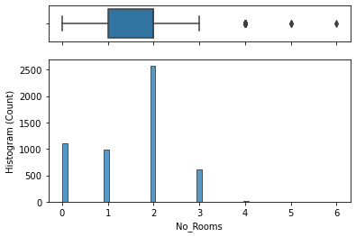
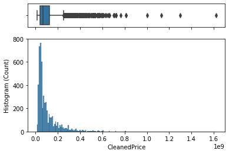
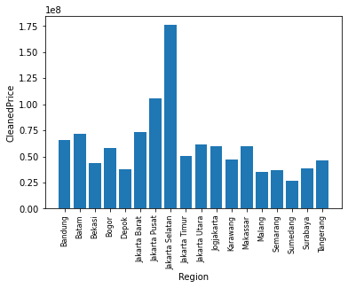
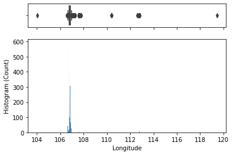
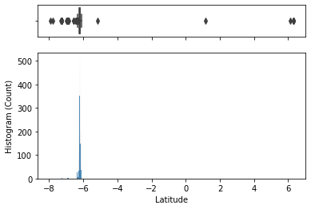

# Exploratory Data Analysis using Machine Learning

Dataset: 'HousePrice'

Melakukan beberapa perintah untuk mengekplore dan menganalisis dataset "HousePrice", yaitu:
1. Membuat kolom baru bernama CleanedPrice, berdasarkan informasi dari kolom Annual_Price dan Currency, dengan Asumsi 1 USD = 15000 IDR

2. Menganalisis kolom No_Rooms dan CleanedPrice

3. Apartemen di Kota/Kabupaten yang memiliki rata-rata harga paling tinggi, kemudian membuat visualisasi untuk mendukung klaim tersebut
Dengan hasil:

4. Analisis kolom Longitude dan Latitude. Apakah ada kejanggalan?

